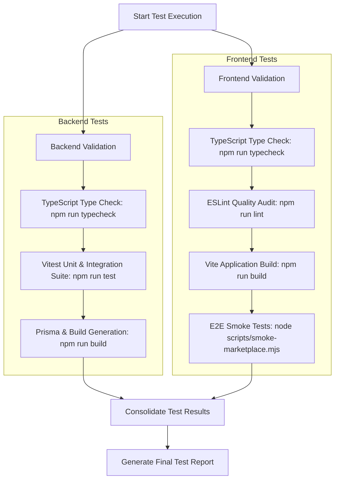

# Full Test Suite Execution Plan for CMM

## Objective
Validate the complete functionality, code quality, type safety, build integrity, and end-to-end flows for both the backend and frontend of the Construction Materials Marketplace (CMM).

## System Workflow

## Actionable Execution Plan

1. **Backend Test Suite Execution**
   - Run `npm run typecheck` inside `backend/` directory to verify static typing.
   - Run `npm run test` (`vitest run`) inside `backend/` directory to execute all unit and integration tests (Auth, Products, Orders, RFQs, Payments, Inventory).
   - Run `npm run build` inside `backend/` to ensure Prisma schema generation and TypeScript compilation succeed without errors.

2. **Frontend Quality & Build Suite Execution**
   - Run `npm run typecheck` inside `frontend/` directory to ensure zero TypeScript errors.
   - Run `npm run lint` inside `frontend/` directory to enforce ESLint standards.
   - Run `npm run build` inside `frontend/` directory to verify production Vite bundle generation.

3. **End-to-End Marketplace Smoke Tests**
   - Run `node scripts/smoke-marketplace.mjs` inside `frontend/` to test critical user flows (Auth, Marketplace, Seller workspace).

4. **Results Analysis & Reporting**
   - Aggregate all exit codes and test output logs.
   - Document any regressions, failures, or bottlenecks identified during test execution.
